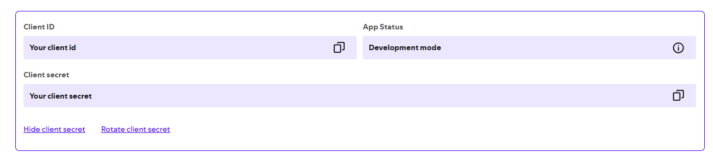

# Spotify-BillBoard-100-Playlist

## Features

- A terminal-based application which creates playlists of top 100 songs according to Billboard on Spotify.
- This program takes a date as input from the user, then using Beautiful Soup, it scrapes the Billboard hot-100 songs for the week with that date.
- Using the data collected, the program then searches spotify for those songs and adds them to a playlist linked to the user's account (Authorization Required!).

## Requirements and Running the Project

- The project uses the following libraries as dependencies (can be sourced from https://pypi.org/)

  - bs4 (BeautifulSoup)
  - spotipy (https://pypi.org/project/spotipy/)
  - os (usually part of Python 3.x installations)
  - requests (usually part of Python 3.x installations)
  - dotenv (to load environment variables)

## Guide

- You need to create your application at (https://developer.spotify.com/dashboard), if the dashboard doesn't open make sure you're logged-in in your spotify account.
  
  

  - For Redirect URIs, put

  ```
  https://example.com/
  ```

  - For "Which API/SDKs are you planning to use?" atleast select "Web API" for the program to function correctly

- After saving it you need to open it and go to the settings
  
  

- To allow the program to create a new playlist in your account, you will need to set up a `.env` file in the project root as follows:

```
    CLIENT_ID=YOUR_SPOTIFY_CLIENT_ID
    CLIENT_SECRET=YOUR_SPOTIFY_CLIENT_SECRET
```

- Once the dependencies are installed and the environment variables are set, you can run the program by:

```
python main.py
```

- After running it will direct you to a page, just agree and you'll then be redirected to the example.com page.
- Copy the url and paste it in the terminal
